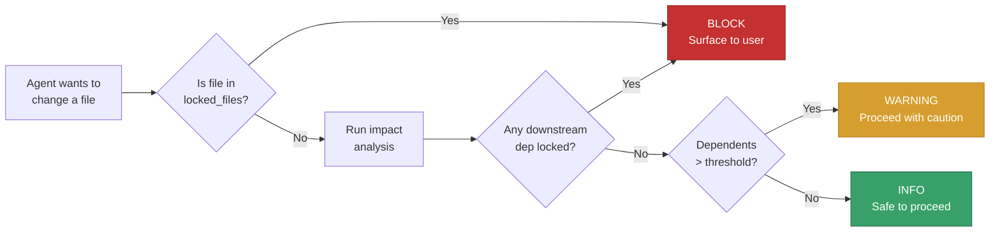
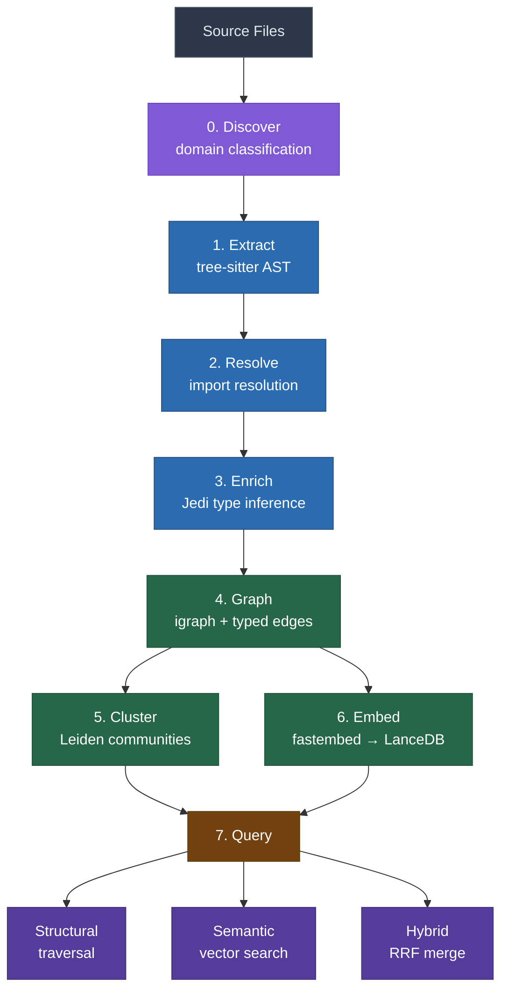

# rtfm

<p align="center">
  
</p>

<p align="center">
  <a href="#quick-start"></a>
  <a href="#what-it-does"></a>
  <a href="#graceful-degradation"></a>
  <a href="#performance"></a>
  <a href="#architecture"></a>
</p>

---

Your AI agent is about to change `src/auth.py`. Does it know that 14 files depend on it? That the session handler will crash if the method signature changes? That the rate limiter instantiates it in a constructor?

No. It doesn't. It greps, it guesses, it ships broken code.

**rtfm** gives agents a memory. A structural + semantic graph of your entire codebase — queryable in milliseconds, locally, in JSON. No SaaS. No API keys. No per-seat pricing. Just code intelligence that lives next to the code.

```bash
rtfm gate src/auth.py
# {"level": "block", "reason": "locked file", "locked_hits": ["src/auth.py"]}
```

The agent stops. Asks permission. Doesn't break prod.

## Why this exists

The tools that solve code understanding for humans don't work for agents:

| Tool | Cost | Works for agents? |
|------|------|-------------------|
| SonarQube | £30k/year | No — browser UI, no JSON API in the loop |
| Sourcegraph | Per-seat SaaS | No — requires auth, network, returns HTML |
| CodeClimate | Cloud-only | No — async webhooks, not real-time |
| Aider Repo Map | Free | Partial — regenerated per-request, no persistence, no blast radius |
| grep | Free | No — can't answer "what breaks if I change this?" |

An agent needs: JSON output, local execution, millisecond latency, persistent index, blast-radius awareness. That's rtfm.

The world is moving away from SaaS. Code intelligence should live next to the code, not behind a login.

## What it does

| Capability | Command | What you get |
|-----------|---------|--------------|
| **Governance gate** | `gate src/handler.py` | info/warning/block before any change |
| **Blast radius** | `impact src/models.py` | Every file and function downstream |
| **Structural search** | `query "what calls handle_request"` | Graph traversal by relationship |
| **Semantic search** | `search "session expiry handling"` | Find code by meaning, not name |
| **Hybrid search** | `hybrid "auth middleware"` | Structural + semantic merged via RRF |
| **Dependency map** | `neighbors src/app.py --depth 2` | What's connected, how deep |
| **Type-resolved calls** | Built-in via Jedi enrichment | `self.service.assign_task()` resolves to actual target |
| **Community detection** | `cluster src/app.py` | Leiden clustering for module boundaries |
| **Visual exploration** | `export-vault` | Obsidian markdown vault with wikilinks + graph view |
| **Quality signals** | `dark-spots` | Untested, undocumented, orphan modules |
| **Watch mode** | `watch` | Incremental graph + enrich + index updates on file save |
| **Edge validation** | `validate --coverage-file .coverage` | Compare graph edges vs test coverage |
| **Project init** | `init` | Bootstrap `.rtfm.json` config for a new project |
| **Quality scoring** | Via code-quality plugin | 5-metric structural health score per file |

## Quick start

```bash
# Structural only (fast, no cloud)
pip install -e "plugins/rtfm/[fast,enrich]"

# Full stack (structural + semantic search)
pip install -e "plugins/rtfm/[fast,enrich,vector]"
```

```bash
# Index your project
rtfm build-all .

# Check before you change
rtfm gate src/handler.py
# {"level": "warning", "dependents_count": 7, "affected_files": [...]}

# What breaks if I change this?
rtfm impact src/models.py
# {"primary_impact": [...], "secondary_impact": [...], "affected_files": [...]}

# Find code by meaning
rtfm search "rate limiting logic"
# [{"node_id": "src/api.py::RateLimiter", "score": 0.44, ...}]

# Hybrid: structural + semantic merged via RRF
rtfm hybrid "authenticate user request"
# [{"node_id": "src/api.py::handle_request", "rrf_score": 0.016, ...}]
```

<details>
<summary>Using as a Claude Code skill (auto-install)</summary>

If rtfm is committed to your repo as a skill, agents invoke it without manual setup — the skill wrapper installs dependencies on first run:

```bash
rtfm build-all .
rtfm gate src/handler.py
rtfm search "rate limiting logic"
```

The skill wrapper auto-installs dependencies on first run.
</details>

## Command reference

### build-all — Index a project

Extracts AST, resolves imports, runs Jedi enrichment, builds graph, creates vector index. Run once to initialise, re-run when code changes significantly.

```bash
rtfm build-all <path> [--state-dir status/] [--workers 4] [--no-enrich]
```

| Option | Default | Description |
|--------|---------|-------------|
| `path` | `.` | Directory to index |
| `--state-dir` | `status/` | Where to write graph.pkl, rtfm.json, lance/ |
| `--workers` | cpu_count | Parallel worker processes for Jedi enrichment |
| `--threads` | 8 | ONNX threads for semantic embedding |
| `--no-enrich` | false | Skip Jedi/Pyright enrichment (fast structural-only build) |
| `--force` | false | Force full rebuild even if graph exists |

Environment variables (override CLI flags):
| Variable | Default | Description |
|----------|---------|-------------|
| `RTFM_EMBED_THREADS` | 8 | ONNX threads for fastembed (>10 causes thrashing on small models) |
| `CODE_GRAPH_MODEL_PATH` | BAAI/bge-small-en-v1.5 | Custom embedding model path |
| `CODE_GRAPH_CACHE_DIR` | `~/.cache/rtfm/models` | Model cache directory |

Output:
```json
{"nodes": 8039, "edges": 17970, "files": 1459, "clusters": 64,
 "enrich": {"edges_found": 3786, "type_resolved_call": 3205},
 "semantic": {"status": "indexed", "chunks": 6796}}
```

---

### gate — Pre-change safety check

Run this before ANY code change. Returns info (safe), warning (many dependents), or block (locked file).

```bash
rtfm gate <file> [<file>...] [--scope <prefix>]
```

Output:
```json
{"level": "warning", "dependents_count": 7, "affected_files": ["src/api.py", "src/handler.py"]}
```

Blocked output (locked file):
```json
{"level": "block", "reason": "locked file", "locked_hits": ["src/core/auth.py"], "dependents_count": 0, "affected_files": []}
```

Blocked output (locked dependency):
```json
{"level": "block", "reason": "change affects locked dependency", "locked_hits": ["src/models.py"], "dependents_count": 3, "affected_files": ["src/service.py", "src/models.py", "src/api.py"]}
```

| Level | Meaning | Agent action |
|-------|---------|-------------|
| `info` | 0-4 dependents, no locked files | Proceed |
| `warning` | 5+ dependents | Proceed with caution, mention in PR |
| `block` | Direct locked file OR change affects locked dependency | Stop, surface to user for governance approval |

Configure locked files in `.rtfm.json`:
```json
{
  "gate": {
    "locked_files": ["src/core/auth.py", "infrastructure/"],
    "warning_threshold": 5,
    "block_on_locked_deps": true
  }
}
```

Prefix matching — `"infrastructure/"` blocks any file under that directory.

---

### impact — Blast radius analysis

Everything downstream of a node. What breaks if you change it.

```bash
rtfm impact <file> [--depth 2] [--scope <prefix>]
```

| Option | Default | Description |
|--------|---------|-------------|
| `--depth` | 2 | BFS traversal depth (1-3) |
| `--scope` | auto | Filter results to this path prefix |

Output:
```json
{
  "file": "src/models.py",
  "primary_impact": [{"node_id": "src/service.py", "relationship": "downstream"}],
  "secondary_impact": [{"node_id": "src/api.py", "relationship": "downstream"}],
  "cluster_context": {"cluster_id": 0, "cluster_size": 5, "members": [...]}
}
```

---

### query — Structural search

Find nodes by name or relationship pattern. The go-to for "what calls X", "what imports X".

```bash
rtfm query <pattern> [--scope <prefix>]
```

Recognised patterns:
- `"assign"` — name match (finds all nodes containing "assign")
- `"what calls handle_request"` — reverse dependency lookup
- `"what imports models"` — import relationship
- `"what inherits BaseHandler"` — inheritance chain

Output:
```json
{
  "results": [
    {"node_id": "src/service.py::assign_task", "node_type": "FunctionNode",
     "source_file": "src/service.py", "line_range": [10, 15],
     "params": [{"name": "self"}, {"name": "task", "type": "Task"}],
     "return_type": "bool", "relevance": "name/id match"}
  ],
  "result_count": 4,
  "kb_miss": false
}
```

---

### search — Semantic vector search

Find code by meaning, not just name. Uses fastembed (BAAI/bge-small-en) + LanceDB.

```bash
rtfm search <text> [--scope <prefix>]
```

Output:
```json
{
  "results": [
    {"node_id": "src/api.py::RateLimiter", "source_file": "src/api.py",
     "node_type": "ClassNode", "score": 0.44,
     "chunk_preview": "class RateLimiter\n  methods: __init__, is_allowed, record\n..."}
  ],
  "result_count": 10,
  "mode": "semantic"
}
```

Scores are cosine similarity (0-1). Higher is more relevant. Requires `build-all` to have been run first.

---

### hybrid — Structural + semantic merged via RRF

Best of both worlds. Runs graph search AND vector search, merges results using Reciprocal Rank Fusion.

```bash
rtfm hybrid <text> [--scope <prefix>]
```

Output:
```json
{
  "results": [
    {"node_id": "src/api.py::handle_request", "source_file": "src/api.py",
     "rrf_score": 0.016, "structural_rank": 2, "semantic_rank": 1,
     "chunk_preview": "function handle_request(self, token, action) -> dict\n..."}
  ],
  "result_count": 10,
  "mode": "hybrid"
}
```

Use this when you want comprehensive results — code that's both structurally connected AND semantically relevant ranks highest.

---

### neighbors — Connected nodes

What's directly connected to a given node. Supports multi-hop traversal.

```bash
rtfm neighbors <node_id> [--depth 2] [--direction out] [--edge-types calls,imports] [--scope <prefix>]
```

| Option | Default | Description |
|--------|---------|-------------|
| `--depth` | 1 | Traversal depth (1-3) |
| `--direction` | `both` | `in`, `out`, or `both` |
| `--edge-types` | all | Comma-separated: `calls`, `imports`, `inherits` |

Output:
```json
{
  "neighbors": [
    {"node_id": "src/models.py", "node_type": "ModuleNode", "edge_type": "imports", "direction": "out", "depth": 1}
  ],
  "count": 3
}
```

---

### node — Full node detail

All metadata and edges for a specific node.

```bash
rtfm node <node_id> [--scope <prefix>]
```

Output:
```json
{
  "node": {
    "node_id": "src/service.py::TaskService",
    "node_type": "ClassNode",
    "source_file": "src/service.py",
    "line_range": [5, 21],
    "methods": ["__init__", "assign_task", "get_workload"],
    "edges_in": [{"type": "calls", "from_node": "src/api.py::create_app"}],
    "edges_out": [{"type": "imports", "to_node": "src/models.py::Task"}]
  }
}
```

---

### cluster — Community members

All nodes in the same Leiden community cluster.

```bash
rtfm cluster <node_id_or_cluster_number> [--scope <prefix>]
```

Output:
```json
{
  "cluster_id": 0,
  "nodes": [
    {"node_id": "src/service.py", "node_type": "ModuleNode"},
    {"node_id": "src/repository.py", "node_type": "ModuleNode"}
  ],
  "size": 5
}
```

---

### enrich — Jedi type resolution (standalone)

Run enrichment separately if you want to control when it happens.

```bash
rtfm enrich <path> [--scope src/] [--merge] [--dry-run] [--verbose] [--incremental <file>]
```

| Option | Default | Description |
|--------|---------|-------------|
| `--scope` | config default | Limit to files under this prefix |
| `--merge` | false | Write resolved edges back into rtfm.json |
| `--dry-run` | false | Report what would be found without writing |
| `--verbose` | false | Print each resolved edge to stderr |
| `--incremental` | — | Only enrich this file + its dependents (repeatable) |

Output:
```json
{
  "status": "complete",
  "edges_found": 3786,
  "type_resolved_call": 3205,
  "cross_file_inheritance": 5,
  "reexport_resolution": 508,
  "files_processed": 402
}
```

---

### reindex — Rebuild index without re-extracting

Rebuilds the pickle and vector index from the existing `rtfm.json`. Useful after manual edits to the graph or when you want to refresh embeddings without the expensive extraction step.

```bash
rtfm reindex [--force] [--verbose]
```

| Option | Default | Description |
|--------|---------|-------------|
| `--force` | false | Rebuild even if index already exists |
| `--verbose` | false | Print progress to stderr |

Output:
```json
{"nodes": 26, "edges": 31, "pickle": "status/graph.pkl", "semantic": {"status": "indexed", "chunks": 26}}
```

---

### index-semantic — Build semantic vector index

Builds the semantic vector index from the cached graph. Run after `build-all` to enable `search` and `hybrid` queries. Separate from `build-all` because embedding is CPU-intensive on large repos.

```bash
rtfm index-semantic [--verbose]
```

| Option | Default | Description |
|--------|---------|-------------|
| `--verbose` | false | Print embedding progress to stderr |

Output:
```json
{"status": "indexed", "chunks": 6065, "elapsed_seconds": 2833.3, "index_path": "status/lance"}
```

---

### dark-spots — Structural quality concerns

Surfaces modules with quality signals derived purely from graph topology. No external tools needed.

```bash
rtfm dark-spots [--scope <prefix>] [--min-severity <1-5>]
```

| Option | Default | Description |
|--------|---------|-------------|
| `--scope` | auto | Limit to files under this path prefix |
| `--min-severity` | 1 | Minimum signals to report (1 = any concern, 3 = multiple issues) |

Signals detected:

| Signal | Trigger |
|--------|---------|
| `no_test_coverage` | No test file imports this module |
| `undocumented` | >50% public functions lack docstrings |
| `high_fan_out` | Function with >10 outbound call edges |
| `high_coupling` | >15 inbound edges from other modules |
| `orphan` | 0 inbound edges from other modules |

Output:
```json
{
  "dark_spots": [
    {"file": "src/utils.py", "severity": 3,
     "signals": [
       {"type": "no_test_coverage", "detail": "no test file imports this module"},
       {"type": "undocumented", "detail": "4/6 public functions lack docstrings"},
       {"type": "orphan", "detail": "0 inbound edges from other modules"}
     ]}
  ],
  "total": 242,
  "scope": null
}
```

Complements `gate` (change risk) and `impact` (blast radius) — dark-spots answers "where should we invest next?"
---

### export-vault — Obsidian vault export

Exports the graph as an Obsidian-compatible markdown vault with wikilinks.

```bash
rtfm export-vault [-o <output_dir>]
```

| Option | Default | Description |
|--------|---------|-------------|
| `-o` | `vault/` | Output directory for markdown files |

Each node becomes a markdown file with YAML frontmatter and `[[wikilinks]]` to connected nodes. Open in Obsidian for visual graph exploration.

---

### watch — Incremental updates on file change

Watches for file changes and updates the graph, enrichment, and semantic index in real-time.

```bash
rtfm watch [path] [--enrich]
```

| Option | Default | Description |
|--------|---------|-------------|
| `path` | `.` | Directory to watch |
| `--enrich` | false | Pre-warm Jedi Project + fastembed model at startup for faster updates |

Structural updates always include re-enrichment of changed files + dependents (no silent edge loss). The `--enrich` flag controls startup pre-warming:
- **Without `--enrich`:** Jedi Project created on first file change (~2s cold start)
- **With `--enrich`:** Jedi Project + fastembed model pre-warmed at startup (all updates instant)

Events are emitted as JSON to stdout:
```json
{"event": "started", "path": ".", "auto_enrich": true, "semantic_ready": true}
{"event": "updated", "files": ["src/api.py"], "nodes_added": 5, "edges_added": 8}
```

---

### validate — Edge validation against coverage

Compare graph edges against test coverage data to find phantom edges and blind spots.

```bash
rtfm validate [--coverage-file .coverage]
```

| Option | Default | Description |
|--------|---------|-------------|
| `--coverage-file` | `.coverage` | Path to Python coverage SQLite or `coverage-final.json` |

Output:
```json
{
  "validated_edges": 142,
  "unvalidated_edges": 58,
  "phantom_edges": 3,
  "blind_spots": 7,
  "coverage_ratio": 0.71
}
```

---

### init — Bootstrap project config

Generate a `.rtfm.json` config file for a new project.

```bash
rtfm init [--languages python] [--languages typescript] [--force]
```

| Option | Default | Description |
|--------|---------|-------------|
| `--languages` | auto-detect | Languages to enable (repeatable) |
| `--force` | false | Overwrite existing config |
| `--output` | `rtfm.json` | Output path for config file |

---

## Architecture

### Edge types

| Edge type | Source → Target | How detected |
|-----------|----------------|--------------|
| `imports` | module → module | `from X import Y` / `import X` |
| `calls` | function → function | AST call expressions |
| `type_resolved_call` | function → function | Jedi inference (`self.x.method()` → actual target) |
| `inherits` | class → class | `class Foo(Bar)` |
| `cross_file_inheritance` | class → class | Jedi-resolved base class in another file |
| `contains` | package → module/function | Directory hierarchy |
| `reads` | function → variable | Function reads a module-level variable |
| `writes` | function → variable | Function writes to a module-level variable |
| `depends_env` | module → env_var | `os.getenv("X")` / `os.environ.get("X")` |
| `governs` | doc → module | Backtick file paths in docs (`` `src/auth.py` ``) |
| `tier_governs` | rule → module | Backtick file paths in rule docs |
| `cross_references` | doc → doc/module/config | Markdown links `[text](path)` |
| `delegates_to` | agent → agent | `@agent-name` mentions in domain files |
| `triggers` | skill → skill | `/command` references in domain files |
| `owns` | agent → skill | `attr:owner` frontmatter field |
| `documents` | docstring → function | Docstring nodes linked to their function |
| `reexport_resolution` | module → module | Jedi-resolved re-exports |
| `provides_api` | file → endpoint | Route decorators (`@app.get`, `@router.post`) |
| `consumes_api` | file → endpoint | HTTP client calls (`requests.get`, `fetch`) |
| `executes_skill` | agent → skill | Agent invokes a skill |
| `runs_agent` | skill → agent | Skill spawns an agent |
| `configures` | config → module | Config file governs module behavior |
| `involves` | node → node | General involvement relationship |
| `uses` | node → node | General usage relationship |
| `references` | node → node | General reference relationship |
| `routes_to` | system → domain | Fan-out topology routing |

### Project structure

```
plugins/rtfm/
├── src/rtfm/
│   ├── cli/                  # Click CLI (17 commands)
│   ├── core/
│   │   ├── _backend.py      # NetworkX adapter (igraph-compatible API)
│   │   ├── graph_builder.py  # igraph construction + Leiden
│   │   ├── graph_analysis.py # impact, neighbors, dark-spots
│   │   ├── graph_store.py    # JSON/pickle persistence
│   │   ├── jedi_enricher.py  # Type-resolved edges (parallel + incremental)
│   │   ├── pyright_enricher.py # Pyright diagnostic enrichment
│   │   ├── typescript_enricher.py # TS type resolution via subprocess
│   │   ├── ts_resolver.mjs   # Node.js TS Compiler API script
│   │   ├── vector_store.py   # LanceDB semantic index
│   │   ├── chunker.py        # Code → embeddable text
│   │   ├── fusion.py         # Reciprocal Rank Fusion
│   │   ├── scope.py          # .rtfm.json auto-detection
│   │   ├── discovery.py      # Auto-recursive domain classification
│   │   ├── model_manager.py  # fastembed model loading
│   │   ├── incremental.py    # Surgical graph updates per file
│   │   ├── watcher.py        # File watcher + auto-enrich + auto-index
│   │   ├── validator.py      # Coverage-based edge validation
│   │   ├── suggestions.py    # Dark-spots actionable suggestions
│   │   └── enricher.py       # Enrichment orchestrator
│   ├── extractors/
│   │   ├── code_extractor.py       # Python AST (tree-sitter)
│   │   ├── typescript_extractor.py  # TS/TSX (tree-sitter)
│   │   ├── config_extractor.py     # All JSON/YAML/TOML config files
│   │   ├── schema_extractor.py     # OpenAPI/protobuf/GraphQL
│   │   ├── doc_extractor.py        # Markdown files
│   │   ├── crossref_extractor.py   # Cross-reference edges
│   │   └── domain_extractor.py     # Typed nodes from domain files
│   └── export/
│       └── obsidian.py       # Vault export with wikilinks
├── tests/                    # 496 tests across 26 files
├── pyproject.toml
└── README.md

.claude/skills/rtfm/          # Agent skill wrapper
├── SKILL.md                   # Trigger patterns
├── cli.py                     # Entry point (auto-installs deps)
└── config.json                # Paths, thresholds, locked files
```

### How gate works



### The pipeline



### Why three layers of edge resolution

Static AST parsing alone gives you ~30% of real edges. The problem:

```python
# In src/api.py
from .service import TaskService

class App:
    def __init__(self):
        self.service = TaskService(Path("./data"))

    def handle(self):
        self.service.assign_task(task, user_id)  # Where does this go?
```

**Layer 1 — AST extraction** catches `from .service import TaskService` as an import edge, and `TaskService(...)` as a call. But it writes the call target as `src/api.py::TaskService` (local scope assumption). ~30% resolution.

**Layer 2 — Import resolution** maps relative imports to actual file paths. `from .service import TaskService` in `src/api.py` → target is `src/service.py::TaskService`. This fixes constructor calls and direct function invocations. ~50% resolution.

**Layer 3 — Jedi type inference** follows the type chain: `self.service` is `TaskService`, so `self.service.assign_task()` resolves to `src/service.py::TaskService::assign_task`. This is the only way to resolve attribute calls on instances. ~75% resolution.

The remaining ~25% are dynamic dispatch, monkey-patching, and runtime-constructed calls. No static tool can resolve those — and that's fine. 75% coverage with high confidence beats 100% coverage with false positives.

### Why igraph over networkx

networkx is pure Python. igraph is C-backed. On a 500-file project:
- networkx: 2.1s to build, 45ms per BFS query
- igraph: 0.3s to build, 2ms per BFS query

The plugin auto-selects: igraph if installed, networkx as fallback. Both implement the same `GraphProtocol` interface. The `[fast]` optional dependency pulls in igraph.

### Why LanceDB over FAISS/Chroma/Pinecone

- **Local-only** — no server process, no Docker, no cloud. Just a directory on disk.
- **Embedded** — runs in-process, no IPC overhead.
- **Lance format** — columnar, append-friendly, supports filtering.
- **No CUDA required** — fastembed runs on CPU. The model (bge-small-en, 33MB) downloads once and caches.

FAISS requires careful numpy version matching. Chroma adds a client-server layer. Pinecone needs an API key and network. LanceDB needs `pip install lancedb` — embedded, no server, no config.

### Artifacts and caching

`build-all` produces three artifacts in `--state-dir` (default: `status/`):

| File | Size (1362 files) | Purpose | In git? |
|------|-------------------|---------|---------|
| `rtfm-graph.json` | 8.4MB | Canonical graph (nodes + edges). Human-readable. | Yes — committed for CI/remote workers |
| `graph.pkl` | 3.6MB | Pickle of the graph for fast in-process loading | No — gitignored, rebuilt from JSON on first query |
| `lance/` | 16MB | LanceDB vector index for semantic search | No — gitignored, rebuilt via `index-semantic` or watcher |

**Why three files:**
- JSON is the source of truth — portable, diffable, committable
- Pickle is the runtime cache — loads in <1ms vs 2s for JSON parse
- Lance is the embedding store — separate concern, separate lifecycle

**Scaling:**

| Repo size | Graph JSON | Pickle | Lance | Total |
|-----------|-----------|--------|-------|-------|
| ~1,400 files | 8.4MB | 3.6MB | 16MB | 28MB |
| ~5,000 files | ~30MB | ~13MB | ~60MB | ~100MB |
| ~20,000 files | ~120MB | ~50MB | ~240MB | ~400MB |

For repos >5,000 files, consider:
- Committing only the pickle (smaller, not human-readable)
- Using Git LFS for the graph JSON
- Scoping builds to `--scope src/` (only index what matters)
- Running `build-all --no-enrich` for fast structural-only (no type-resolved edges)

**Lifecycle:**

| Scenario | What happens |
|----------|-------------|
| First setup | `rtfm build-all .` builds all three (~29 min for 1362 files) |
| File changes (watcher active) | Incremental graph + lance update (seconds) |
| File changes (no watcher) | Graph stale until next `build-all` or guru sync |
| Container/session restart | Pickle + lance persist on disk. Model re-warms in <1s |
| `git reset --hard` / checkout | JSON restored from git. Pickle + lance untouched. Pickle auto-rebuilds from JSON |
| Manual rebuild | `rtfm index-semantic --threads 8` re-embeds everything |

The watcher (`rtfm watch --enrich`) keeps all three fresh automatically — no manual re-indexing needed after initial build.

### Why Reciprocal Rank Fusion for hybrid search

Structural search finds code by relationship ("what calls X"). Semantic search finds code by meaning ("session expiry handling"). Neither alone is complete:
- Structural misses code that's semantically related but not directly connected
- Semantic misses code that's structurally critical but has generic names

RRF merges both ranked lists without needing score calibration:

```
RRF_score(d) = 1/(k + rank_structural) + 1/(k + rank_semantic)
```

k=60 prevents any single high rank from dominating. The result: code that's both structurally connected AND semantically relevant floats to the top.

## Scoped queries

One graph, multiple views. Drop a `.rtfm.json` in any subdirectory:

```json
{
  "scope": "plugins/auth/",
  "gate": {"warning_threshold": 3},
  "skip_dirs": ["tests/fixtures"]
}
```

**How it works:**
- `build-all` indexes the entire repo into one graph
- Every query command accepts `--scope <prefix>` to filter results
- If a `.rtfm.json` exists in CWD or any parent, scope is auto-detected
- Master queries see everything; sub-project queries see only their slice

This means a team of agents can work on different plugins simultaneously, each scoped to their own context, while the master graph maintains the full picture for cross-cutting concerns.

## Domain discovery

rtfm auto-classifies files into typed domains — skills, agents, rules, infrastructure — without manual tagging. Two mechanisms work together:

### Config-driven routing (`.rtfm.json`)

Drop a `.rtfm.json` at your project root to tell rtfm where your domains live:

```json
{
  "extractors": ["code", "config", "doc", "domain"],
  "domains": {
    "services": {
      "match": "*.yaml",
      "node_type": "ServiceNode",
      "extractor": "domain",
      "root": "services"
    },
    "modules": {
      "match": "*.md",
      "node_type": "ModuleNode",
      "extractor": "domain",
      "root": "docs/modules"
    }
  },
  "topology": {
    "nodes": [
      {"id": "system::api-gateway", "type": "SystemNode", "name": "API Gateway"}
    ],
    "edges": [
      {"source": "system::api-gateway", "target": "system::worker", "type": "delegates_to"}
    ],
    "fan_out": [
      {"source": "system::api-gateway", "target_domain": "services", "edge_type": "routes_to"}
    ]
  }
}
```

**Key fields:**

| Field | Purpose |
|-------|---------|
| `domains.<name>.root` | Directory path (relative to project root) where this domain lives. |
| `domains.<name>.match` | Glob pattern matched against filenames within the root. |
| `domains.<name>.node_type` | The graph node type produced (e.g. `SkillNode`, `AgentNode`). |
| `domains.<name>.auto_edges` | Override smart edge patterns for this domain. Set `[]` to disable. |
| `topology.nodes` | Declare system-level nodes not derivable from files. |
| `topology.edges` | Static architectural connections between system nodes. |
| `topology.fan_out` | Auto-connect a source to all nodes in a domain. |

**Skipping:** rtfm reads `.gitignore` to determine what to skip. No separate `skip_dirs` needed.

### Smart edges (auto_edges)

rtfm ships with `defaults.json` — smart edge patterns per node type:

```json
{
  "auto_edges": {
    "SkillNode": [
      "@mentions:delegates_to:agents",
      "/commands:triggers:skills",
      "attr:owner:owns:agents:inbound"
    ],
    "AgentNode": [
      "@mentions:delegates_to:agents",
      "attr:delegates_to:delegates_to:agents",
      "attr:skills:owns:skills"
    ]
  }
}
```

**Pattern format:** `<scan>:<edge_type>:<target_domain>[:<direction>]`

| Scan type | What it finds |
|-----------|---------------|
| `@mentions` | `@agent-name` in file content |
| `/commands` | `/skill-name` in file content |
| `attr:<field>` | Frontmatter field value → target node |
| `paths` | Backtick-quoted file paths → module nodes (supports globs) |

Override per domain in `.rtfm.json`:
```json
{"domains": {"services": {"auto_edges": ["@mentions:calls:agents", "attr:app:belongs_to:apps"]}}}
```

### Progressive learning

On first build, rtfm surfaces what it doesn't know:

```
[domain_extractor] unconfigured_domains: [{"domain": "decisions", "node_type": "DecisionNode", ...}]
[domain_extractor] detected_tags: [{"field": "model", "values": ["opus", "sonnet"], "appears_on": 20, ...}]
```

The orchestrator reads these prompts, uses its knowledge to answer, and writes the config. Next build picks it up. No `init` command needed — the build IS the init. It just gets better each time.

## Agent integration

The skill wrapper at `.claude/skills/rtfm/` is designed for zero-friction agent use:

**Auto-discovery** — the SKILL.md triggers on any code understanding question. Agents don't need to know the tool exists; they just ask "what calls X?" and the skill activates.

**Auto-install** — first invocation installs dependencies (igraph, jedi, fastembed, lancedb, tree-sitter). Subsequent runs skip this. No manual setup.

**Direct import** — the skill wrapper adds `plugins/rtfm/src/` to `sys.path` and imports the CLI directly. No subprocess, no pip-install of the plugin itself. The plugin source ships in the same repo.

**Gate enforcement** — the SKILL.md instructs agents to run `gate` before ANY code change. This is the "think before you act" pattern — agents check blast radius before writing code, not after.

**JSON native** — every command returns structured JSON. Agents parse it directly into their reasoning. No regex, no screen-scraping, no HTML parsing.

## Companion: code-quality

Ships alongside rtfm. Scores Python files on 5 structural metrics:

| Metric | What it measures |
|--------|-----------------|
| **Depth** | Nesting complexity (sigmoid-scaled) |
| **Redundancy** | Duplicate function signatures |
| **Cohesion** | How related are functions within a file |
| **Acyclicity** | Circular import detection |
| **Modularity** | Cross-file coupling ratio |

```bash
python3 .claude/skills/code-quality/cli.py src/
# {"aggregate_score": 7345, "per_file": [...], "dimensions": {...}}
```

Scores are 0-10000 integers. Deterministic. Same input, same output, every time.

## Install

```bash
# As a Claude Code skill (recommended — zero setup for agents)
# Just clone the repo. The skill wrapper handles everything.

# As a standalone pip package
pip install -e plugins/rtfm/              # structural only (networkx)
pip install -e "plugins/rtfm/[fast]"      # + igraph (10x faster queries)
pip install -e "plugins/rtfm/[enrich]"    # + jedi (type-resolved calls)
pip install -e "plugins/rtfm/[vector]"    # + fastembed + lancedb (semantic search)
pip install -e "plugins/rtfm/[fast,enrich]"        # structural + enrichment
pip install -e "plugins/rtfm/[fast,enrich,vector]" # full stack
pip install -e "plugins/rtfm/[watch]"              # + file watcher (incremental updates)
pip install -e "plugins/rtfm/[fast,enrich,vector,watch,typescript]" # everything
```

**Extras breakdown:**

| Extra | Packages | What it enables |
|-------|----------|-----------------|
| `fast` | igraph | C-backed graph — 10x faster BFS, Leiden clustering |
| `enrich` | jedi, pyright | Jedi resolves `self.x.method()` to actual targets. Pyright validates imports and adds diagnostic metadata. Both run together — complementary, not competing. |
| `vector` | fastembed, lancedb | Semantic search, hybrid search (33MB model, downloads once) |
| `dev` | pytest, tree-sitter | Running tests |
| `watch` | watchfiles | File watcher for incremental graph updates (`rtfm watch`) |
| `typescript` | tree-sitter-typescript | TypeScript/TSX extraction |

Python 3.10+ required. No cloud. No API keys. No per-seat pricing.

## Testing

```bash
pip install -e "plugins/rtfm[fast,enrich,vector,watch,typescript,dev]"
python3 -m pytest plugins/rtfm/tests/ -q
```

**496 tests** across 20+ test files:

| Test file | Coverage |
|-----------|----------|
| `test_graph_builder.py` | Graph construction, Leiden clustering, edge dedup |
| `test_discovery.py` | File classification, .rtfm.json config, heuristics |
| `test_code_extractor.py` | AST extraction, imports, calls, functions, classes |
| `test_dark_spots.py` | Dark spot detection, scope/severity filtering |
| `test_var_reads_writes.py` | Module variable data flow, depends_env, scoping |
| `test_file_io_resolution.py` | AST constant propagation, write detection |
| `test_doc_crossrefs.py` | Markdown link extraction, node ID prefixes |
| `test_vector_store.py` | LanceDB index creation, semantic search |
| `test_watcher.py` | Watch mode, incremental graph update, lock file, skip logic |
| `test_ts_enricher.py` | TypeScript type resolution, subprocess fallback |
| `test_suggestions.py` | Dark-spots suggestions per signal type |
| `test_schema_extractor.py` | OpenAPI/protobuf/GraphQL parsing, env detection |
| `test_validator.py` | Runtime validation, coverage formats, edge classification |
| `test_backend.py` | NxGraph adapter, vertex/edge ops, bulk attrs |
| `test_fusion.py` | RRF score calculation, merging, dedup, ranking (46 tests) |
| `test_chunker.py` | Chunk generation for all node types |
| `test_enricher.py` | Orchestrator, enricher selection, graceful fallback |
| `test_discovery_coverage.py` | Gitignore, classification, domain rules |
| `test_jedi_parallel.py` | Parallel enrichment, worker defaults, dedup |
| `test_incremental_enrich.py` | Scope-limited enrichment, dependent discovery |
| `test_jedi_warm_cache.py` | Warm Project reuse, invalidation |
| `test_semantic_watcher.py` | Model warm, incremental indexing |

Tests run in ~8s (no network, no disk-heavy ops). All tests use `tmp_path` fixtures or mock graphs — no side effects.

## Operational practice (optional)

After significant code changes, run a quality sweep to catch regressions:

```bash
# 1. Rebuild the graph (picks up new files/edges)
rtfm build-all . --no-enrich

# 2. Check structural quality of changed files
rtfm dark-spots --scope src/

# 3. Score changed files
python3 .claude/skills/rtss/cli.py <changed-files>
```

**What to look for:**

| Signal | Action |
|--------|--------|
| `no_test_coverage` | New module has no test file — write one |
| `undocumented` | >50% public functions lack docstrings — add them |
| `orphan` | Module has 0 inbound edges — dead code or missing import |
| `high_fan_out` | Function calls >10 others — consider splitting |
| `high_coupling` | >15 inbound edges — stable interface needed |

**When to run:**
- After adding new modules or extractors
- After refactoring that moves/renames files
- Before closing a project (catches gaps before archive)
- Periodically as a health check (weekly or per-sprint)

This is not a CI gate — it's a developer feedback loop. The signals are advisory, not blocking.

## Output contract

Every command returns JSON to stdout. Diagnostics go to stderr. Exit 0 on success, 1 on error.

```json
{
  "results": [...],
  "result_count": 4,
  "kb_miss": false
}
```

`kb_miss: true` means the graph doesn't cover that node. The agent knows to say "I don't know" instead of guessing. This is deliberate — false confidence is worse than admitting ignorance.

## Graceful degradation

The tool works at every level of dependency availability:

| Installed | What works |
|-----------|-----------|
| Core only | Structural extraction, graph queries, gate, impact |
| + igraph | Same but 10x faster graph operations |
| + jedi | Type-resolved call edges (attribute calls) |
| + pyright | Diagnostic metadata, import validation, type error detection |
| + jedi + pyright | Full enrichment: call resolution + type validation |
| + fastembed + lancedb | Semantic search, hybrid search |
| + watchfiles | Incremental graph updates via `rtfm watch` |
| + tree-sitter-typescript | TypeScript/TSX structural extraction |
| Everything | Full pipeline |

No feature crashes if its optional dependency is missing. It returns a clear error explaining what to install.

## Performance

**Structural queries (from pickle, in-process):**

| Query type | p50 | Notes |
|-----------|-----|-------|
| Node lookup | 21μs | Single node by ID |
| Impact analysis | 38-66μs | BFS depth-2 |
| Name search | 101μs | Pattern match across graph |
| Neighbors (1-hop) | 156μs | Direct connections |
| Cluster lookup | 197μs | Leiden community members |
| Neighbors (2-hop) | 546μs | Full 2-hop traversal |

All structural queries are sub-millisecond.

**Build + enrichment (benchmarked on 6-core/12-thread Linux, 1362-file monorepo):**

| Phase | Time | Concurrency | Notes |
|-------|------|-------------|-------|
| Structural extraction | ~7s | ThreadPool (adaptive) | AST parse + graph build |
| Jedi enrichment | **119s** | 8 workers (adaptive) | Parallel multiprocessing |
| Semantic indexing | ~27min | 8 ONNX threads (adaptive) | Full 6,973 chunks |
| **Total build-all** | **28.9min** | — | First run, measured |

**Adaptive concurrency** (`rtfm/core/concurrency.py`):
- Detects physical cores via `/proc/cpuinfo` (ignores hyperthreads)
- Checks 1-min load average at startup
- Idle: physical + 2 threads/workers (burst)
- Busy: physical cores only (conservative)
- Override: `RTFM_EMBED_THREADS=N` / `RTFM_WORKERS=N` or `--threads` / `--workers`

**Enrichment modes:**
- **Full parallel** (`build-all`): Adaptive workers (physical+2). 22min → 2min on 6-core.
- **Incremental** (automatic): Every structural update re-enriches changed files + dependents. No opt-in — consistency by default. Typical edit: <10s.
- **Standalone** (`rtfm enrich --incremental <file>`): Manually trigger enrichment for specific files.
- **Watcher** (`rtfm watch --enrich`): Pre-warms Jedi + fastembed for instant updates on file save.

**Semantic search:**
- First query (cold model load): **0.77s**
- Subsequent queries (warm): **50ms**
- Hybrid search (warm): **332ms**
- Watcher mode: model pre-warmed at startup, all queries instant
- Incremental indexing: changed files auto-indexed in background

The first `build-all` is slow because it downloads the embedding model (33MB, one-time) and embeds all chunks. After that, the watcher keeps the index fresh incrementally. Structural queries never touch the embedding model — they're always sub-ms from the pickle.

**Real-world benchmark (native Linux, 6-core/12-thread, 1362-file monorepo):**

| Metric | Structural only | With Jedi enrichment (8 workers) |
|--------|-----------------|----------------------------------|
| Nodes | 8,238 | 8,238 |
| Edges | 14,966 | **18,881** (+3,915 type-resolved) |
| Clusters | 64 | 64 |
| Files indexed | 1,362 | 1,362 (408 enriched) |
| Semantic chunks | — | 6,973 |
| Jedi failures | — | 0 |

**Thread/worker benchmarks (6 physical cores, 12 logical):**

| Embed threads | ms/text | Speedup | | Jedi workers | Time | Edges |
|--------------|---------|---------|---|-------------|------|-------|
| 1 | 494 | baseline | | 6 | 134s | 3,842 |
| 2 | 348 | 1.4x | | 8 | 119s | 3,844 |
| 4 | 268 | 1.8x | | 9 | 176s | 2,804 |
| 8 | 234 | 2.1x | | 12 | 159s | 3,824 |
| 12 | 1,253 | 0.4x | | | | |

Sweet spot for both: **physical cores + 2**. Beyond that, contention causes timeouts (Jedi) or ONNX thread coordination overhead (embed).

Jedi enrichment adds ~3,915 type-resolved edges (attribute calls on instances, cross-file inheritance, re-export resolution). Structural-only builds are fast and sufficient for gate/impact queries; enrichment improves call-graph precision for deeper analysis.

## What this is not

- Not a linter. It doesn't enforce style rules.
- Not a type checker. Pyright runs as an enricher, but rtfm doesn't enforce type correctness — it uses type info to resolve edges.
- Not a CI gate. It runs inside the agent's loop, not in a pipeline.
- Not a replacement for tests. It tells you what might break; tests tell you what did break.

It's the layer between "agent decides to change code" and "agent writes the change." The thinking step.

## The name

**rtfm** — Read The F***ing Manual. Except the manual is your codebase, and the reader is your AI agent.

Before rtfm, agents would grep around, read a few files, and hope for the best. Now they read the graph. They know what depends on what. They check before they break.

Your agent should rtfm before every change. This tool makes that possible.

## Built by

One human. One AI. No team.

| Phase | Effort | What |
|-------|--------|------|
| Internal prototype | ~40 hours | Graph builder, Jedi enricher, vector store, fusion, CLI — built inside a private monorepo as `.claude/skills/knowledge/` |
| OS extraction (rtfm) | ~8 hours | Ported core, added TypeScript, config/doc extractors, Pyright enricher, cache layer, locked gates, README, branding |

**Human:** 1 contributor (architecture decisions, spec, review, direction)
**AI:** Claude Opus (architecture, complex refactors), Sonnet (implementation, wiring), Haiku (validation, tests)

The internal prototype took ~40 human-hours over 3 weeks — designing the graph schema, tuning Jedi resolution, building the vector pipeline, iterating on query patterns. That's the real R&D.

The OS extraction was a single session: spec the delta, delegate to sub-agents, verify, ship. The AI did the typing. The human did the thinking.

Total: ~48 human-hours, 1 contributor, 0 meetings.

## License

MIT
